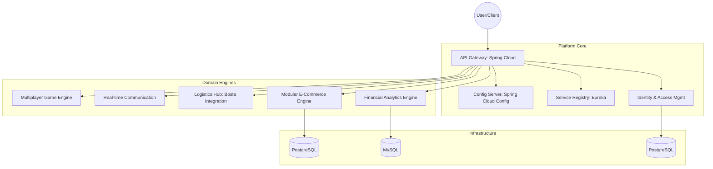

# Enterprise-Grade Distributed Cloud Infrastructure

[](#)
[](#)
[](#)

## Overview

This project is a production-grade, distributed cloud ecosystem designed to unify multiple business domains under a high-availability infrastructure. This repository serves as the **Master Hub** and **Orchestration Layer** for the entire platform.

Built with a **Platform-as-a-Product** mindset, the ecosystem decouples core infrastructure (Gateway, Identity, Config) from specific business logic, enabling independent scaling and rapid domain expansion.

---

## Project Structure

This mono-repo is organized into logical tiers to maintain a clean separation of concerns:

```text
/Projects/Main
├── core-infrastructure/           # --- THE PLATFORM BRAIN ---
│   ├── api-gateway/               # Central entry point (Spring Cloud)
│   ├── authy-service/             # Custom Identity Provider (Stateless JWT)
│   ├── config-server/             # Centralized configuration (Spring Config)
│   ├── discovery-server/          # Service registry (Netflix Eureka)
│   └── logging-service/           # Distributed tracing logic
│
├── domain-services/               # --- BUSINESS LOGIC ENGINES ---
│   ├── finance/savvy-service      # AI-Powered expense tracker
│   ├── fashion/simuclothing-service # Modular e-commerce engine
│   ├── automotive/carloger-service # Consolidated vehicle logs
│   ├── gaming/spacepusher-service # Real-time multiplayer engine
│   └── messaging/vox-service      # Real-time chat backbone
│
├── shared-services/               # --- UTILITY ECOSYSTEM ---
│   ├── delivery-service/          # Logistics (Bosta Integration)
│   ├── payment-service/           # Payment processing (Paymob Integration)
│   ├── notification-service/      # SMS/Email dispatch
│   └── media-service/             # Secure file/image uploads
│
├── client-applications/           # --- THE USER FACES ---
│   ├── savvy-web/                 # Finance dashboard (Angular)
│   ├── simuclothing-web/          # E-commerce storefront (Angular)
│   ├── carloger-web/              # Automotive portal (Angular)
│   └── spacepusher-web/           # Game interface (Angular)
│
└── devops-utilities/              # --- DX & OPS HUB ---
    └── scripts/                   # Automation & Setup utilities
```

---

## High-Level Architecture

The ecosystem follows a strict microservices pattern with a decentralized data strategy.



---

## The Core Chassis

| Repository                                   | Technical Function                         | Primary Stack        |
| :------------------------------------------- | :----------------------------------------- | :------------------- |
| **[distributed-cloud-infrastructure](link)** | Gateway, Discovery, and Centralized Config | Spring Cloud, Eureka |
| **[identity-access-management](link)**       | Stateless JWT, OAuth2.0, & RBAC            | Spring Security, JPA |
| **[dev-ops-utilities](link)**                | Team Onboarding & Migration Automation     | Shell (Bash), Docker |

---

## Domain Services

| Service                                   | Purpose                   | Innovation Highlight                          |
| :---------------------------------------- | :------------------------ | :-------------------------------------------- |
| **[ai-financial-analytics-engine](link)** | Expense Tracking          | Integrated Spring AI for predictive budgeting |
| **[modular-ecommerce-api](link)**         | Fashion Marketplace       | Real-time Bosta Logistics integration         |
| **[realtime-state-sync-engine](link)**    | Multi-device coordination | Socket.io event-driven synchronization        |

---

## Architectural Decisions

- **Java/Spring Boot**: Chosen for its robust ecosystem and support for cloud-native patterns.
- **Stateless Authentication**: JWTs ensure the platform can scale horizontally without session synchronization.
- **Container-First Strategy**: Every service is fully Dockerized to guarantee environment parity (Dev -> Prod).
- **Service Discovery**: Eureka allows services to find each other without hardcoded IP addresses, enabling dynamic deployment.

---

## Developer Experience (DX) & Automation

The platform includes a suite of automation tools in `/devops-utilities/scripts/` to streamline development and operations:

1.  **Onboarding**: `./devops-utilities/scripts/team_onboarding.sh`
    - Verifies technical dependencies (Java, Maven, Docker, Node).
    - Sets up the internal `platform-network`.
    - Initializes local configuration files from templates.
2.  **Diagnostics**: `./devops-utilities/scripts/ecosystem_doctor.sh`
    - Checks the health of core infrastructure (Postgres, MySQL, Zipkin).
    - Verifies connectivity to the Service Registry and API Gateway.
3.  **Orchestrator**: `./devops-utilities/scripts/build_all.sh`
    - Compiles and installs all modules in the correct architectural order.

### Quick Start

To spin up the ecosystem for the first time:

```bash
./devops-utilities/scripts/team_onboarding.sh
./devops-utilities/scripts/build_all.sh
docker-compose -f core-infrastructure/docker-compose.yml up -d
./devops-utilities/scripts/ecosystem_doctor.sh
```

---

## Roadmap

- [ ] **Distributed-Logging**: Transitioning from local logs to ELK Stack (Logstash, Kibana).
- [ ] **Automated CI/CD**: Implementing GitHub Actions for automated testing and deployment.

---

_Architected by Omar Ayman._
