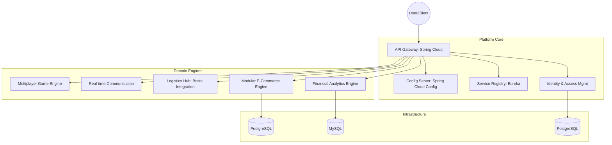

# Enterprise-Grade Distributed Cloud Infrastructure

## Overview

This project is a production-grade, distributed cloud ecosystem designed to unify multiple business domains under a high-availability infrastructure. This repository serves as the **Master Hub** and **Orchestration Layer** for the entire platform.

Built with a **Platform-as-a-Product** mindset, the ecosystem decouples core infrastructure (Gateway, Identity, Config) from specific business logic, enabling independent scaling and rapid domain expansion.

---

## Project Structure

This mono-repo is organized into logical tiers to maintain a clean separation of concerns:

```text
/Projects/Main
├── core-infrastructure/           # --- THE PLATFORM BRAIN ---
│   ├── api-gateway/               # Central entry point (Spring Cloud)
│   ├── authy-service/             # Custom Identity Provider (Stateless JWT)
│   ├── config-server/             # Centralized configuration (Spring Config)
│   ├── discovery-server/          # Service registry (Netflix Eureka)
│   └── logging-service/           # Distributed tracing logic
│
├── domain-services/               # --- BUSINESS LOGIC ENGINES ---
│   ├── finance/savvy-service      # AI-Powered expense tracker
│   ├── fashion/simuclothing-service # Modular e-commerce engine
│   ├── automotive/carloger-service # Consolidated vehicle logs
│   ├── gaming/spacepusher-service # Real-time multiplayer engine
│   └── messaging/vox-service      # Real-time chat backbone
│
├── shared-services/               # --- UTILITY ECOSYSTEM ---
│   ├── delivery-service/          # Logistics (Bosta Integration)
│   ├── payment-service/           # Payment processing (Paymob Integration)
│   ├── notification-service/      # SMS/Email dispatch
│   └── media-service/             # Secure file/image uploads
│
├── client-applications/           # --- THE USER FACES ---
│   ├── savvy-web/                 # Finance dashboard (Angular)
│   ├── simuclothing-web/          # E-commerce storefront (Angular)
│   ├── carloger-web/              # Automotive portal (Angular)
│   └── spacepusher-web/           # Game interface (Angular)
│
└── devops-utilities/              # --- DX & OPS HUB ---
    └── scripts/                   # Automation & Setup utilities
```

---

## High-Level Architecture

The ecosystem follows a strict microservices pattern with a decentralized data strategy.



---
