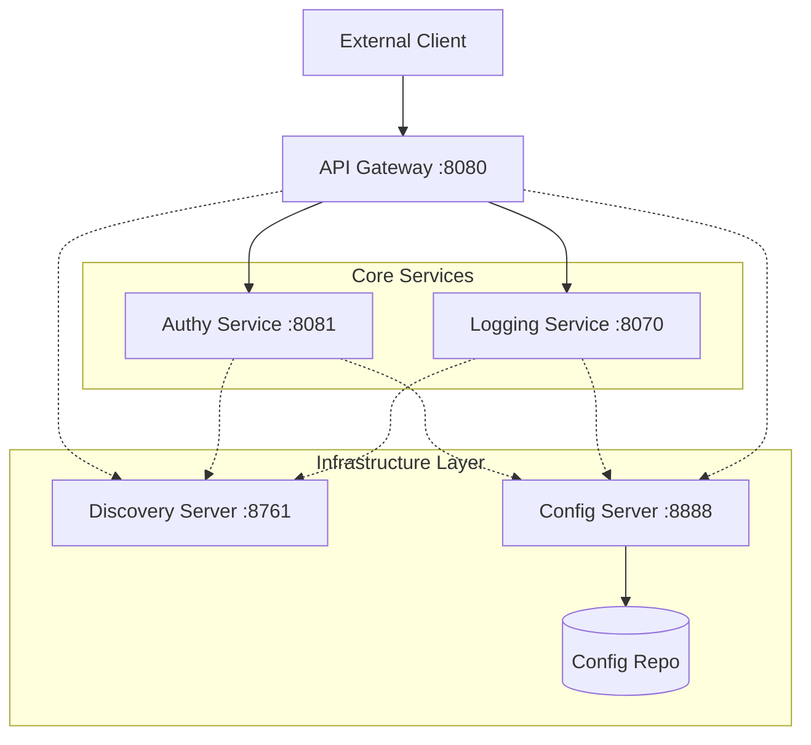

# Platform Core

Welcome to the heart of the Distributed Infrastructure Ecosystem. This directory contains the base infrastructure and cross-cutting services required to run a scalable, reliable microservices architecture.

## Architecture Overview

The platform follows a standard Cloud-Native pattern using Spring Cloud components.



---

## Platform Components

### 1. Discovery Server (Eureka)

- **Port:** 8761
- **Role:** The "Phonebook" of our system. Every microservice registers itself here so other services can find it without knowing its exact IP address.
- **Why?** In a cloud environment, instances can spin up or down; Eureka ensures the system remains dynamic.

### 2. Config Server & Config Repo

- **Port:** 8888
- **Role:** Centralized configuration management.
- **Workflow:**
  1. Configurations are stored as YAML files in the `config-repo`.
  2. The `config-server` reads these files (via Git/File system).
  3. Other services fetch their settings from the `config-server` during startup (using `bootstrap.yml`).
- **Why?** Change a setting once in the repo (like a database password), and it propagates to all relevant services without a rebuild.

### 3. API Gateway (Spring Cloud Gateway)

- **Port:** 8080
- **Role:** The single entry point for all external traffic.
- **Routing Rules:**
  - `/api/auth/**` → Proxied to `authy-service`.
  - `/api/logs/**` → Proxied to `logging-service`.
- **Why?** It handles security, rate limiting, and hides the internal complexity of the cluster from the client.

### 4. Logging Service

- **Port:** 8070
- **Role:** A centralized log aggregator. Services send their runtime logs here via a simple POST request.
- **Key Endpoint:** `POST /api/logs`

### 5. Authy Service

- **Port:** 8081
- **Role:** Handles User Identities, JWT Generation, and Multi-Factor Authentication (MFA).
- **Key Endpoints:** `/api/register`, `/api/login`, `/api/verify-code`.

---

## Getting Started

To start the platform core, run the services in the following order:

1. **Discovery Server:** Must be up first so others can register.
2. **Config Server:** Must be up so others can download their configurations.
3. **Core Services:** `logging-service` and `authy-service`.
4. **API Gateway:** The final layer to expose everything.

### Commands

In each service directory:

```bash
mvn spring-boot:run
```

---

## Educational Insights

> [!TIP]
> **What is `bootstrap.yml`?**
> Unlike `application.yml`, `bootstrap.yml` is loaded by Spring Cloud during the _bootstrap_ phase. It's used to tell the app where it can find its actual configuration (e.g., the URL of the Config Server).

> [!NOTE]
> **Client-Side Load Balancing (`lb://`)**
> In the `api-gateway` configuration, you'll see URIs like `lb://authy-service`. The `lb://` prefix tells the gateway to use Eureka to resolve the service name and perform load balancing if multiple instances are running.

> [!IMPORTANT]
> **Path Rewriting**
> Notice how the gateway rewrites `/api/auth/login` to `/api/login` before sending it to `authy-service`. This allows the gateway to have its own clean URL structure without forcing the internal services to match it exactly.
